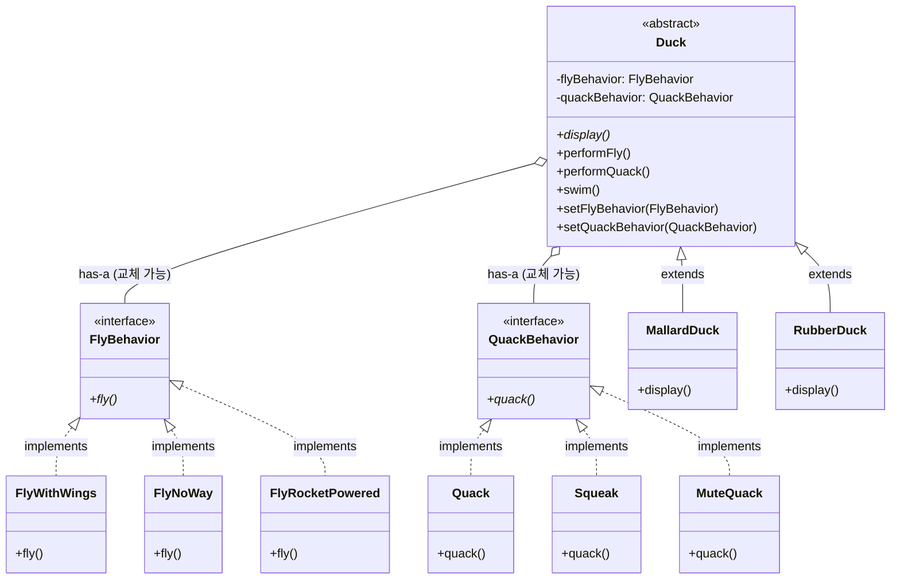

# Week 1. 전략 패턴 (Strategy Pattern)

## 학습 정보

- **주차**: 1주차
- **챕터**: Chapter 1
- **패턴명**: 전략 패턴 (Strategy Pattern)
- **학습일**: 2025-02-10
- **학습 범위**: Chapter 1 전체

---

## 학습 목표

- 상속의 한계와 문제점을 이해하고 이를 해결할 수 있는 방법을 학습한다
- 전략 패턴의 개념과 구현 방법을 이해한다
- 디자인 원칙 3가지를 학습하고 적용할 수 있다

---

## 핵심 개념

### 패턴이 해결하는 문제

**발단**

- Duck 클래스를 상속받아 여러 종류의 오리를 구현 중
- 새로운 요구사항: 모든 오리에게 fly() 기능 추가 필요

**문제 발생**

- Duck 부모 클래스에 fly() 메소드를 추가함
- 모든 자식 클래스가 fly() 메소드를 상속받게 됨
- 하지만 일부 오리(고무오리, 가짜오리)는 날 수 없어야 함

**해결 시도 1: Override**

- 날 수 없는 오리 클래스에서 fly() 메소드를 override
- 문제: Duck의 모든 자식 클래스를 일일이 확인하고 수정해야 함
- 유지보수 어려움 → 상속은 해결책이 아님

**해결 시도 2: Interface만 분리**

- FlyBehavior, QuackBehavior 인터페이스만 생성
- 각 Duck 서브클래스에서 인터페이스를 직접 구현
- 문제:
  - 날 수 있는 오리들이 각각 fly()를 중복 구현해야 함
  - 행동 변경 시 해당 행동을 구현한 모든 클래스를 수정해야 함
  - 코드 재사용이 안 됨 → 인터페이스만으로는 부족

**최종 해결: 전략 패턴 (행동의 구성)**

- 행동을 구현한 별도의 클래스를 만들어 캡슐화
- Duck은 행동을 직접 구현하지 않고, 행동 객체에 위임
- setter 메소드로 외부에서 행동을 동적으로 변경 가능
- 알고리즘군을 캡슐화하고 클라이언트로부터 분리

### 패턴의 정의

**전략 패턴 (Strategy Pattern)**

알고리즘군을 정의하고 캡슐화하여 각각을 교체 가능하게 만든다.
전략 패턴을 사용하면 알고리즘을 사용하는 클라이언트와 독립적으로 알고리즘을 변경할 수 있다.

### 주요 구성요소

**3가지 디자인 원칙**

1. 애플리케이션에서 달라지는 부분을 찾아내고, 달라지지 않는 부분과 분리한다
2. 구현보다는 인터페이스에 맞춰서 프로그래밍한다
3. 상속보다는 구성(Composition)을 활용한다

**구성 요소**

- Context (Duck): 전략을 사용하는 역할. 행동을 직접 구현하지 않고 행동 인터페이스에 위임한다
- Strategy Interface (FlyBehavior, QuackBehavior): 알고리즘군의 공통 인터페이스
- Concrete Strategy (FlyWithWings, FlyNoWay, Quack, Squeak): 실제 알고리즘 구현체

---

## 패턴 구조

### UML 다이어그램



### 동작 방식

1. Duck 객체가 생성될 때 적절한 행동 객체(Strategy)를 할당받음
2. performFly(), performQuack() 메소드 호출 시 할당된 행동 객체에게 실행을 위임
3. setFlyBehavior(), setQuackBehavior()로 런타임에 행동 교체 가능
4. Duck은 구체적인 행동 구현을 알 필요 없이 인터페이스를 통해 행동을 위임

---

## 코드 예제

### 예제 상황

오리 시뮬레이션 게임에서 다양한 종류의 오리를 구현하고,
각 오리의 날기와 소리내기 행동을 유연하게 변경할 수 있도록 구현

### 주요 코드

```typescript
// 전략 인터페이스 정의
interface FlyBehavior {
  fly(): void;
}

interface QuackBehavior {
  quack(): void;
}

// 구체적인 전략 구현
class FlyWithWings implements FlyBehavior {
  fly(): void {
    console.log("날개로 날아갑니다!");
  }
}

class FlyNoWay implements FlyBehavior {
  fly(): void {
    console.log("저는 못 날아요.");
  }
}

class FlyRocketPowered implements FlyBehavior {
  fly(): void {
    console.log("로켓 추진으로 날아갑니다!");
  }
}

class Quack implements QuackBehavior {
  quack(): void {
    console.log("꽥꽥!");
  }
}

class Squeak implements QuackBehavior {
  quack(): void {
    console.log("삑삑!");
  }
}

class MuteQuack implements QuackBehavior {
  quack(): void {
    console.log("< 조용... >");
  }
}

// Context 클래스
abstract class Duck {
  protected flyBehavior: FlyBehavior;
  protected quackBehavior: QuackBehavior;

  constructor(flyBehavior: FlyBehavior, quackBehavior: QuackBehavior) {
    this.flyBehavior = flyBehavior;
    this.quackBehavior = quackBehavior;
  }

  abstract display(): void;

  // 행동을 직접 구현하지 않고 위임
  performFly(): void {
    this.flyBehavior.fly();
  }

  performQuack(): void {
    this.quackBehavior.quack();
  }

  swim(): void {
    console.log("모든 오리는 물에 뜹니다.");
  }

  // 런타임에 행동 교체 가능
  setFlyBehavior(fb: FlyBehavior): void {
    this.flyBehavior = fb;
  }

  setQuackBehavior(qb: QuackBehavior): void {
    this.quackBehavior = qb;
  }
}

// 구체적인 Duck 구현
class MallardDuck extends Duck {
  constructor() {
    super(new FlyWithWings(), new Quack());
  }

  display(): void {
    console.log("저는 청둥오리입니다.");
  }
}

class RubberDuck extends Duck {
  constructor() {
    super(new FlyNoWay(), new Squeak());
  }

  display(): void {
    console.log("저는 고무오리입니다.");
  }
}

// 사용 예시
const mallard = new MallardDuck();
mallard.display(); // 저는 청둥오리입니다.
mallard.performFly(); // 날개로 날아갑니다!
mallard.performQuack(); // 꽥꽥!

// 동적으로 행동 변경
mallard.setFlyBehavior(new FlyRocketPowered());
mallard.performFly(); // 로켓 추진으로 날아갑니다!

const rubber = new RubberDuck();
rubber.display(); // 저는 고무오리입니다.
rubber.performFly(); // 저는 못 날아요.
rubber.performQuack(); // 삑삑!
```

### 코드 설명

- Duck 클래스는 행동을 직접 구현하지 않고 인터페이스 타입의 참조 변수를 가짐
- 실제 행동은 전략 객체에 위임(delegation)
- 생성자로 초기 전략을 주입하고, setter로 런타임에 변경 가능
- 새로운 행동 추가 시 Duck 클래스 수정 없이 새로운 전략 클래스만 추가

---

## 실전 활용

### 언제 사용하면 좋을까?

- 관련된 알고리즘군이 있고, 런타임에 하나를 선택해야 할 때
- 같은 작업을 수행하지만 구현 방식이 다양한 경우
- 조건문(if-else, switch)이 복잡하게 얽혀있어 유지보수가 어려울 때
- 알고리즘의 변형이 필요하고, 클라이언트가 이를 선택해야 할 때

### 장단점

**장점**

- OCP(개방-폐쇄 원칙) 준수: 기존 코드 수정 없이 새로운 전략 추가 가능
- 런타임에 알고리즘 교체 가능
- 조건문 제거로 코드 가독성 향상
- 알고리즘을 사용하는 코드와 알고리즘 구현 분리

**단점**

- 클래스 수가 증가함 (전략마다 클래스 필요)
- 클라이언트가 적절한 전략을 선택하기 위해 전략들의 차이를 알아야 함
- 단순한 알고리즘의 경우 오버엔지니어링일 수 있음

### 실제 적용 사례

**결제 시스템**

- 신용카드, PayPal, 카카오페이, 토스페이 등 다양한 결제 방식
- 사용자가 선택한 결제 수단으로 동적 변경

**정렬 알고리즘**

- 데이터 크기와 특성에 따라 QuickSort, MergeSort, BubbleSort 선택
- 정렬은 데이터 특성에 따라 알고리즘 선택이 필요해 전략 패턴의 전형적 적용 대상

**로깅 시스템**

- 파일 저장, 데이터베이스 저장, 클라우드 전송 등
- 환경(개발/운영)에 따라 다른 로깅 전략 사용

**압축 알고리즘**

- ZIP, RAR, GZIP 등 다양한 압축 방식 선택

**AI 추천 시스템**

- 협업 필터링, 콘텐츠 기반 필터링 등 다양한 추천 알고리즘

---

## 핵심 정리

전략 패턴은 **변경되는 부분(알고리즘)을 캡슐화**하여 **런타임에 동적으로 교체** 가능하게 만드는 패턴이다.

**핵심 포인트**

- 상속보다 구성을 활용
