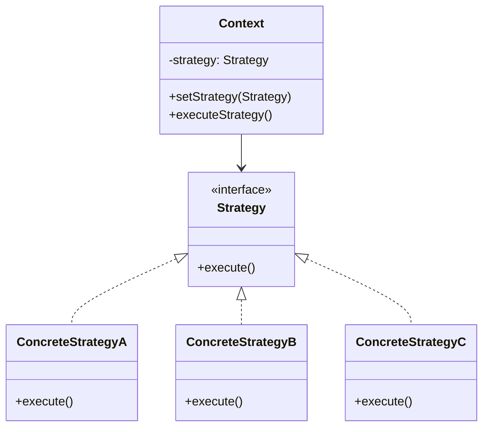
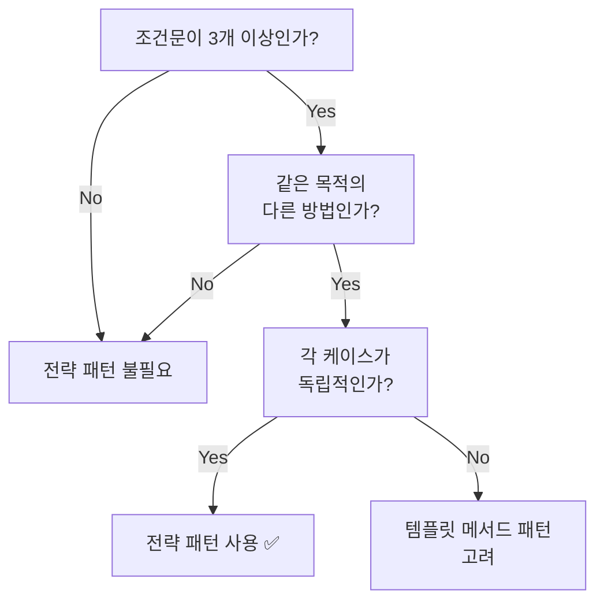

# 전략 패턴 (Strategy Pattern)

> "알고리즘군을 정의하고 각각을 캡슐화하여 교환해서 사용할 수 있도록 만든다. 전략 패턴을 활용하면 알고리즘을 사용하는 클라이언트와는 독립적으로 알고리즘을 변경할 수 있다." - GoF

## 📌 전략 패턴이란?

전략 패턴은 **동일한 목적의 알고리즘을 여러 가지 방식으로 구현하고, 상황에 따라 원하는 알고리즘을 선택해서 사용하는 디자인 패턴**입니다.

행동을 사용하는 쪽(Context)과 실제 구현(Strategy)을 분리해서, 상황에 따라 다른 로직을 쉽게 바꿔 끼울 수 있게 하는 것이 핵심입니다.

> **"무엇을 할지"는 Context가 알고, "어떻게 할지"는 Strategy가 결정한다**

## 🎯 구조


**핵심 3요소:**

1. **Strategy (인터페이스)**: 공통 동작 정의
2. **Concrete Strategy**: 실제 알고리즘 구현
3. **Context**: 전략을 주입받아 실행만 담당

## 🦆 예시: 오리 게임 (Head First Design Patterns)

### 초기 설계
```javascript
class Duck {
  quack() {
    console.log('꽥꽥');
  }
  display() {
    console.log('오리 모양');
  }
}

class RedheadDuck extends Duck {
  display() {
    console.log('붉은머리 오리 모양');
  }
}
```

### 문제 발생: 요구사항 추가

- 오리가 날 수 있게 기능 추가
- 고무 오리, 모형 오리 추가
```javascript
class Duck {
  quack() {
    console.log('꽥꽥');
  }
  display() {
    console.log('오리 모양');
  }
  fly() {
    console.log('날기');
  }
}

class RubberDuck extends Duck {
  display() {
    console.log('고무 오리 모양');
  }
  quack() {
    console.log('삑삑');
  }
  fly() {
    console.log('날 수 없음');  // 오버라이드 필요
  }
}

class DecoyDuck extends Duck {
  display() {
    console.log('모형 오리 모양');
  }
  quack() {
    console.log('소리낼 수 없음');  // 오버라이드 필요
  }
  fly() {
    console.log('날 수 없음');  // 오버라이드 필요
  }
}
```

**문제점:**
1. 날 수 없는 오리나 소리내는 방식이 다른 오리를 추가 시 항상 override 해야 함
2. 오리의 종류가 추가될수록 코드가 복잡해짐
3. 오리가 어떤 기능을 가지고 있는지 코드만으로 파악하기 어려움

### 해결 시도 1: 인터페이스로 분리
```javascript
interface QuackBehavior {
    quack(): void;
}

interface FlyBehavior {
    fly(): void;
}

class RedheadDuck extends Duck implements QuackBehavior, FlyBehavior {
    quack() {
        console.log('꽥꽥');
    }
    fly() {
        console.log('날기');
    }
}

class RubberDuck extends Duck implements QuackBehavior {
    quack() {
        console.log('삑삑');
    }
}
```

**문제점:**
- fly, quack 메서드를 재사용하지 않으므로 동작을 바꾸기 위해서는 모든 오리 클래스를 고쳐야 함

### ✅ 해결: 전략 패턴 적용

#### Step 1: 전략 구현 - 행동을 클래스로 분리
```javascript
// 날기 전략들
class FlyWithWings implements FlyBehavior {
    fly() {
        console.log('오리 날아요~');
    }
}

class FlyNoWay implements FlyBehavior {
    fly() {
        console.log('날 수 없어요');
    }
}

// 꽥꽥거리기 전략들
class Quack implements QuackBehavior {
    quack() {
        console.log('꽥꽥!');
    }
}

class Squeak implements QuackBehavior {
    quack() {
        console.log('삑삑!');
    }
}

class MuteQuack implements QuackBehavior {
    quack() {
        console.log('무음');
    }
}
```

#### Step 2: Context - 전략을 사용하는 오리
```javascript
class Duck {
    quackBehavior: QuackBehavior;
    flyBehavior: FlyBehavior;

    constructor(quackBehavior: QuackBehavior, flyBehavior: FlyBehavior) {
        this.quackBehavior = quackBehavior;
        this.flyBehavior = flyBehavior;
    }

    performQuack() {
        this.quackBehavior.quack();
    }

    performFly() {
        this.flyBehavior.fly();
    }

    display() {
        console.log('오리 모양');
    }
}
```

#### Step 3: 구체적인 오리들
```javascript
class RedheadDuck extends Duck {
    constructor() {
        super(new Quack(), new FlyWithWings());
    }
    display() {
        console.log('붉은머리 오리 모양');
    }
}

class RubberDuck extends Duck {
    constructor() {
        super(new Squeak(), new FlyNoWay());
    }
    display() {
        console.log('고무 오리 모양');
    }
}

class DecoyDuck extends Duck {
    constructor() {
        super(new MuteQuack(), new FlyNoWay());
    }
    display() {
        console.log('모형 오리 모양');
    }
}
```

#### Step 4: 런타임에 행동 변경하기
```javascript
class Duck {
    quackBehavior: QuackBehavior;
    flyBehavior: FlyBehavior;

    constructor(quackBehavior: QuackBehavior, flyBehavior: FlyBehavior) {
        this.quackBehavior = quackBehavior;
        this.flyBehavior = flyBehavior;
    }

    // Setter 추가
    setQuackBehavior(quackBehavior: QuackBehavior) {
        this.quackBehavior = quackBehavior;
    }

    setFlyBehavior(flyBehavior: FlyBehavior) {
        this.flyBehavior = flyBehavior;
    }

    performQuack() {
        this.quackBehavior.quack();
    }

    performFly() {
        this.flyBehavior.fly();
    }
}
```

**사용 예시:**
```javascript
const duck = new RubberDuck();
duck.performQuack();  // 삑삑!
duck.performFly();    // 날 수 없어요

// 런타임에 행동 변경
duck.setQuackBehavior(new Quack());
duck.setFlyBehavior(new FlyWithWings());
duck.performQuack();  // 꽥꽥!
duck.performFly();    // 오리 날아요~
```

## 💡 JavaScript다운 방식 (함수형)

JavaScript는 일급 함수를 지원하므로, 클래스 없이 더 간결하게 구현할 수 있습니다.

### 오리 예시 - 함수형
```javascript
type QuackBehaviorFn = () => void;
type FlyBehaviorFn = () => void;

const flyBehaviors = {
  withWings: () => console.log('오리 날아요~'),
  noWay: () => console.log('날 수 없어요'),
  rocket: () => console.log('로켓으로 날아요!')
} as const;

const quackBehaviors = {
  quack: () => console.log('꽥꽥!'),
  squeak: () => console.log('삑삑!'),
  mute: () => console.log('무음')
} as const;

const createDuck = (
  name: string,
  quackBehavior: QuackBehaviorFn,
  flyBehavior: FlyBehaviorFn
) => ({
  name,
  quack: quackBehavior,
  fly: flyBehavior,
  display: () => console.log(`${name} 오리 모양`)
});
```

**사용:**
```javascript
const prettyDuck = createDuck(
  '예쁜',
  quackBehaviors.quack,
  flyBehaviors.withWings
);

prettyDuck.display();  // 예쁜 오리 모양
prettyDuck.quack();    // 꽥꽥!
prettyDuck.fly();      // 오리 날아요~
```

## 🛠 실전 예제

### 결제 모듈 - 클래스형
```javascript
// 1. 전략 인터페이스
interface PaymentStrategy {
  pay(amount: number): void;
}

// 2. 전략 구현체
class CardPayment implements PaymentStrategy {
  pay(amount: number) {
    console.log(`카드 결제: ${amount}원`);
  }
}

class KakaoPayment implements PaymentStrategy {
  pay(amount: number) {
    console.log(`카카오페이 결제: ${amount}원`);
  }
}

class NaverPayment implements PaymentStrategy {
  pay(amount: number) {
    console.log(`네이버페이 결제: ${amount}원`);
  }
}

// 3. Context
class PaymentContext {
  constructor(private strategy: PaymentStrategy) {}

  setStrategy(strategy: PaymentStrategy) {
    this.strategy = strategy;
  }

  execute(amount: number) {
    this.strategy.pay(amount);
  }
}

// 4. 사용
const context = new PaymentContext(new CardPayment());
context.execute(10000);  // 카드 결제: 10000원

context.setStrategy(new KakaoPayment());
context.execute(20000);  // 카카오페이 결제: 20000원
```

### 결제 모듈 - 함수형
```javascript
// 1. 전략 타입
type PaymentStrategy = (amount: number) => void;

// 2. 전략 구현체
const paymentStrategies = {
  cardPay: (amount: number) => console.log(`카드 결제: ${amount}원`),
  kakaoPay: (amount: number) => console.log(`카카오페이 결제: ${amount}원`),
  naverPay: (amount: number) => console.log(`네이버페이 결제: ${amount}원`)
};

// 3. Context
const payment = (amount: number, strategy: PaymentStrategy) => strategy(amount);

// 4. 사용
payment(10000, paymentStrategies.cardPay);   // 카드 결제: 10000원
payment(20000, paymentStrategies.naverPay);  // 네이버페이 결제: 20000원
```

### 폼 검증
```javascript
const validationStrategies = {
  required: (value) => ({
    isValid: value.trim() !== '',
    message: '필수 입력 항목입니다.'
  }),
  
  email: (value) => ({
    isValid: /^[^\s@]+@[^\s@]+\.[^\s@]+$/.test(value),
    message: '올바른 이메일 형식이 아닙니다.'
  }),
  
  minLength: (min) => (value) => ({
    isValid: value.length >= min,
    message: `최소 ${min}자 이상 입력해주세요.`
  })
};

class FormValidator {
  constructor() {
    this.validators = [];
  }

  addValidation(strategy) {
    this.validators.push(strategy);
    return this;
  }

  validate(value) {
    for (const validator of this.validators) {
      const result = validator(value);
      if (!result.isValid) return result;
    }
    return { isValid: true };
  }
}

// 사용
const emailValidator = new FormValidator()
  .addValidation(validationStrategies.required)
  .addValidation(validationStrategies.email);

emailValidator.validate('test@test.com');
```

### 정렬
```javascript
const sortStrategies = {
  byName: (a, b) => a.name.localeCompare(b.name),
  byPrice: (a, b) => a.price - b.price,
  byDate: (a, b) => new Date(b.createdAt) - new Date(a.createdAt)
};

const products = [
  { name: '노트북', price: 1200000, createdAt: '2024-01-15' },
  { name: '마우스', price: 30000, createdAt: '2024-02-01' }
];

products.sort(sortStrategies.byPrice);  // 가격순 정렬
```

## 🔍 핵심: 전략 패턴 = 스마트한 그룹핑

### 그룹핑 없이
```javascript
// ❌ 흩어져 있는 함수들
function flyWithWings() { console.log('날아요!') }
function flyNoWay() { console.log('못 날아요') }
function quackLoud() { console.log('꽥꽥!') }
function quackSqueak() { console.log('삑삑!') }

// 사용할 때 - 어떤 함수가 "날기"고 어떤 게 "울기"인지 불명확
duck.fly = flyWithWings;
duck.quack = quackLoud;
```

### 그룹핑 후
```javascript
// ✅ 목적별로 그룹핑
const flyBehaviors = {
  withWings: () => console.log('날아요!'),
  noWay: () => console.log('못 날아요'),
  rocket: () => console.log('로켓으로!')
};

const quackBehaviors = {
  loud: () => console.log('꽥꽥!'),
  squeak: () => console.log('삑삑!'),
  mute: () => console.log('...')
};

// 사용할 때 - 의도가 명확
duck.flyBehavior = flyBehaviors.withWings;
duck.quackBehavior = quackBehaviors.loud;
```

**그룹핑의 장점:**
1. **의도 파악**: "아, 이건 날기 전략들이구나"
2. **확장 용이**: 새 전략 추가가 쉬움
3. **네이밍 충돌 방지**: `flyBehaviors.noWay`, `swimBehaviors.noWay` 구분
4. **자동완성**: `flyBehaviors.` 입력 시 선택지가 보임

## 📊 장단점

### 장점

1. **개방-폐쇄 원칙(OCP)**: 기존 코드 수정 없이 새로운 전략 추가 가능
2. **런타임 전환**: 실행 중에 알고리즘 교체 가능
3. **테스트 용이**: 각 전략을 독립적으로 테스트 가능
4. **조건문 제거**: if/else, switch 제거로 가독성 향상
5. **단일 책임 원칙**: 각 전략은 하나의 동작만 책임

### 단점

1. **클래스/객체 증가**: 전략이 많아지면 관리할 객체가 늘어남
2. **클라이언트 인지 필요**: 클라이언트가 전략들의 차이를 알아야 함
3. **오버엔지니어링 가능성**: 단순한 조건문으로 충분한 경우도 있음

## 🤔 언제 사용할까?


### ✅ 사용하면 좋은 경우

- **조건문이 많아질 때**: if/switch 분기 폭증
- **알고리즘이 자주 바뀔 때**: 할인 정책, 결제 방식, 정렬 방식, 인증 로직
- **런타임에 동작을 바꿔야 할 때**: 사용자 선택 기반
- **각 케이스의 로직이 독립적일 때**: 한 케이스 수정이 다른 케이스에 영향 없음

### ❌ 사용하지 않아도 되는 경우

- **분기가 2개 이하로 단순할 때**
```javascript
  const message = isSuccess ? '성공' : '실패'
```
- **전략이 자주 바뀌지 않을 때**: 패턴 적용 비용 > 얻는 이점
- **전략 간 공통 로직이 많을 때**: 템플릿 메서드 패턴이 더 적합

## 💬 마무리

전략 패턴은 **"같은 목적, 다른 방법"을 우아하게 처리하는 패턴**
JavaScript에서는 함수가 일급 객체이기 때문에 클래스 없이도 간결하게 구현할 수 있다. 
**핵심은 "그룹핑"** - 같은 목적의 알고리즘들을 하나의 객체로 묶어서 관리하는 것.

---

## 📚 참고

- Head First Design Patterns 1장
- GoF Design Patterns
