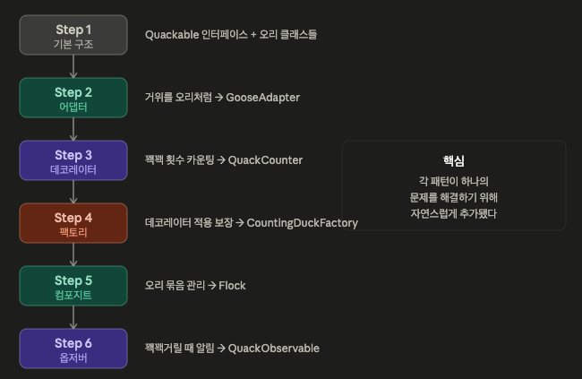
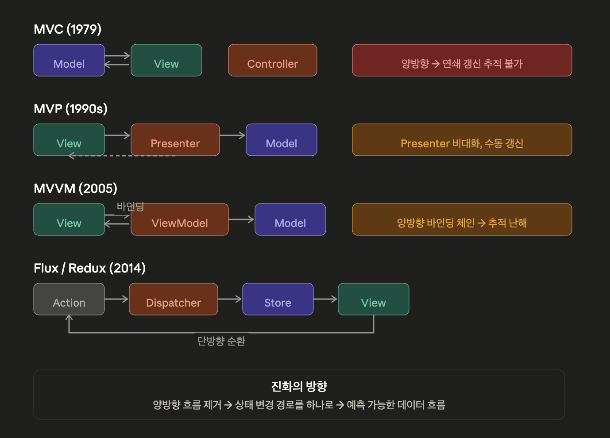
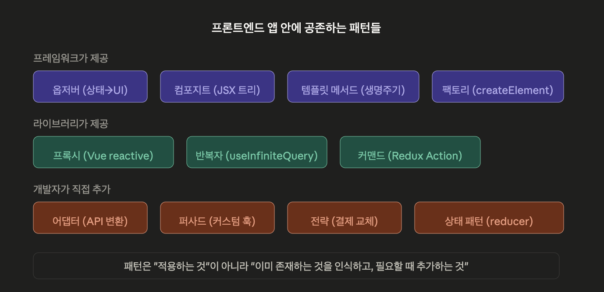

# 복합 패턴

## 이론 정리

### 복합 패턴이란?

> *“패턴 하나로는 복잡한 문제를 못 푼다. 여러 패턴이 함께 일할 때 비로소 아키텍처가 된다.”*
> 

1. 패턴은 독립적으로 존재하지 않음. 실제 시스템에서는 여러 패턴이 동시에 작동
2. 패턴을 억지로 조합하지 말자. 문제가 있고, 그 문제를 풀기 위해 자연스럽게 여러 패턴이 필요해져야 함. 패턴을 적용하기 위해 패턴을 쓰는 것은 안티 패턴

### 오리 시뮬레이터

#### Step 1 - 기본 구조

책의 예시 - `Quackable` 인터페이스를 구현한 여러 오리 클래스

```tsx
interface Quackable {
  quack(): void
}

class MallardDuck implements Quackable {
  quack() { console.log('Quack') }
}
class RedheadDuck implements Quackable {
  quack() { console.log('Quack') }
}
```

#### Step 2 - 어댑터 패턴 추가

거위를 오리처럼 쓰고 싶다면, `GooseAdapter`가 거위의 `honk()`를 `quack()` 으로 변환

```tsx
class GooseAdapter implements Quackable {
  constructor(private goose: Goose) {}
  quack() { this.goose.honk() }
}
```

#### Step 3 - 데코레이터 패턴 추가

꽥꽥 소리 횟수를 세고 싶다 → `QuackCounter` 데코레이터가 호출을 감싸서 카운팅

```tsx
class QuackCounter implements Quackable {
  static count = 0
  constructor(private duck: Quackable) {}
  quack() {
    this.duck.quack()
    QuackCounter.count++
  }
}
```

#### Step 4 - 팩토리 패턴 추가

데코레이터를 빠뜨리지 않고 일관되게 적용하려면 생성을 통제해야 함.
→ `DuckFactory` 가 오리 생성 + 데코레이터 적용을 보장

```tsx
class CountingDuckFactory {
  createMallardDuck(): Quackable {
    return new QuackCounter(new MallardDuck())
  }
  createRedheadDuck(): Quackable {
    return new QuackCounter(new RedheadDuck())
  }
}
```

#### Step 5 - 컴포짓 패턴 추가

오리들을 묶어서 한 번에 관리하고 싶음 → `Flock`이 `Quackable`을 구현하면서 내부에 오리 컬렉션을 가짐

```tsx
class Flock implements Quackable {
  private ducks: Quackable[] = []
  add(duck: Quackable) { this.ducks.push(duck) }
  quack() {
    this.ducks.forEach(d => d.quack())
  }
}
```

#### Step 6 - 옵저버 패턴 추가

오리가 꽥꽥거릴 때 알림을 받고 싶음 
→ `Observable` 인터페이스를 도입해서 관찰자를 등록하고, `quack()` 호출 시 알림을 보냄

```tsx
interface QuackObservable {
  registerObserver(observer: Observer): void
  notifyObservers(): void
}
```

#### 전체 조합



→ 패턴을 처음부터 계획해서 함꺼번에 넣은게 아님

문제가 생기고 → 그 문제에 맞는 패턴이 하나씩 추가

***→ 이것이 복합 패턴의 올바른 접근!***

### MVC

책에서는 MVC를 복합 패턴의 사례로 다룸. MVC 안에 세 패턴이 들어있음

- 옵저버 - Model이 변경되면 View에 알림
- 전략 - View가 Controller를 전략 객체로 사용 (입력 처리 방식 교체 가능)
- 컴포지트 - View가 중첩된 컴포넌트 트리로 구성

```tsx
사용자 입력 → Controller (전략)
                ↓
              Model (상태 변경)
                ↓ (옵저버로 알림)
              View (컴포지트 트리, 화면 갱신)
```

---

## 부록 (Advanced)

### 1. MVC → MVP → MVVM → Flux 진화 흐름

이 진화의 핵심은 “누가 상태를 관리하고, 변경을 누가 알리는가”의 답이 계속 바뀌어왔다는 것

#### MVC

```tsx
User → Controller → Model → View
                      ↑        ↓
                      └────────┘ (옵저버)
```

- 원래의 MVC는 양방향
- Model이 바뀌면 View에 옵저버로 알리고, View가 직접 Model을 읽음
- Controller는 입력을 해석해서 Model을 조작하는 역할.

문제

- 앱이 커지면 Model과 View 사이의 양방향 의존이 스파게티가 됨.

#### MVP

```protobuf
User → View → Presenter → Model
              Presenter → View (갱신 명령)
```

- View와 Model의 직접 연결을 끊음. Presenter가 중개자 역할
- View는 Presenter에게만 이벤트를 보내고, Presenter가 Model을 조작한 뒤 View를 갱신
- 즉, View가 Model을 직접 모름 → Presenter가 둘 사이의 **퍼사드** 역할.

문제

- Presenter가 뚱뚱해짐
- View마다 Presenter가 하나씩 필요, View의 모든 상태를 Presenter가 수동으로 밀어 넣음

#### MVVM

```protobuf
User → View ←→ ViewModel → Model
         (데이터 바인딩)
```

- MVP의 수동 갱신 문제를 데이터 바인딩으로 해결
- ViewModel의 프로퍼티가 바뀌면 View가 자동으로 반영
- 즉, Presenter의 수동 `view.setName(...)` 호출이 사라지고 바인딩이 대체

문제

- 양방향 바인딩이 다시 복잡성을 가져옴.
- ViewModel이 많아지면 바인딩 체인 추적이 어려워짐

#### Flux / Redux

```protobuf
User → Action → Dispatcher → Store → View
                                ↑        ↓
                                └────────┘ (단방향)
```

- Facebook이 MVC의 양방향 데이터 흐름 문제를 겪고 제안한 아키텍쳐
- 핵심은 엄격한 단방향 흐름
- View는 Store를 직접 수정하지 않음
- Action을 발행하고, Dispatcher가 Store에 전달하고, Store가 바뀌면 View가 갱신
- 즉, 양방향 흐름을 완전히 제거. Action → Reducer → Store → View라는 한 방향으로만 흐름



### 2. 패턴 조합의 판단 기준

#### 패턴을 추가해야 하는 신호

항상 문제가 먼저, 문제들이 보이면 패턴을 고려.

```protobuf
"같은 인터페이스인데 모양이 달라서 못 쓴다"
  → 어댑터

"이 복잡한 걸 매번 직접 조합하기 힘들다"
  → 퍼사드

"기능을 추가하고 싶은데 원본을 건드리기 싫다"
  → 데코레이터

"상태에 따라 동작이 달라지는데 분기가 폭발한다"
  → 상태 패턴

"변경이 일어나면 여러 곳이 알아야 한다"
  → 옵저버

"개별 아이템이든 묶음이든 같은 방식으로 다루고 싶다"
  → 컴포지트

"생성 과정이 복잡하거나 일관성을 보장해야 한다"
  → 팩토리
```

#### 패턴을 멈춰야 하는 신호

1. **"이 패턴도 쓸 수 있겠는데?"** → 쓸 수 있다는 건 써야 한다는 뜻이 아니다. 현재 문제가 그 패턴 없이 단순하게 풀린다면 안 쓰는 게 낫다.
2. **패턴 추가 후 코드가 더 어려워졌다** → 패턴은 복잡성을 줄이기 위한 도구인데, 추가했더니 복잡해졌다면 과적용
3. **"나중에 필요할 수도 있으니까"** → YAGNI (You Ain't Gonna Need It). 미래의 가능성을 위한 패턴 적용은 거의 항상 과잉. 지금 필요한 것만.
4. **추상화 레이어가 3겹을 넘었다** → 호출 경로가 `A → B → C → D → E`처럼 깊어지면, 각 레이어에 패턴이 정당하더라도 전체적으로는 추적이 어려워짐.

#### 실전 판단 체크리스트

```protobuf
1. 지금 실제로 겪고 있는 문제인가?
   → "나중에 필요할 수도"면 멈춤

2. 패턴 없이 해결하면 어떤 문제가 생기는가?
   → 구체적으로 답할 수 없으면 멈춤

3. 팀원이 이 코드를 처음 보면 이해할 수 있는가?
   → 패턴을 설명해야만 이해 가능하면 재고
```

---

## 실전 예시

### 전통적인 프로그래밍

#### MVC 프레임워크

- Spring MVC, Ruby on Rails, Django
- 서버사이드 프레임워크가 MVC 복합 패턴의 고전적 구현
- Controller가 요청을 받고, Model을 조작하고, View(템플릿)를 렌더링
- 내부에 전략(라우팅), 옵저버(이벤트), 팩토리가 조합돼 있음

### 프론트엔드 활용

#### 1. React 앱 하나에 들어있는 패턴 조합

React / TanStack Query / Zustand

```tsx
// 옵저버 — 상태 변경 시 컴포넌트 리렌더
const useAuthStore = create((set) => ({
  user: null,
  login: (user) => set({ user }),  // set → 구독자에게 알림
}))

// 어댑터 — API 응답을 도메인 타입으로 변환
const adaptUser = (raw: ApiUser): User => ({
  id: raw.user_id,
  name: raw.full_name,
})

// 퍼사드 — 복잡한 패칭 로직을 단순 인터페이스로
function useCurrentUser() {
  const { data } = useQuery({
    queryKey: ['user'],
    queryFn: async () => adaptUser(await apiClient.get('/me')),
  })
  return data
}

// 컴포지트 — 컴포넌트 트리
function App() {
  return (
    <Layout>           {/* 가지 */}
      <Header />       {/* 잎 */}
      <Sidebar>        {/* 가지 */}
        <NavMenu />    {/* 잎 */}
      </Sidebar>
      <Content />      {/* 잎 */}
    </Layout>
  )
}

// 프록시 — 개발 환경 로깅
const store = isDev ? createDebugProxy(appStore) : appStore
```

- 패턴 5개가 공존
- 필요에 따라 패턴을 적용한 것

#### 2. Next.js 풀스택 앱의 패턴 해부

```tsx
// 템플릿 메서드 — Next.js가 흐름 제어
export async function generateMetadata() { ... }  // 훅 포인트
export default function Page() { ... }            // 훅 포인트

// 퍼사드 — Server Action
'use server'
export async function placeOrder(formData: FormData) {
  // 검증 → DB → 이메일 → 캐시 무효화 → 리다이렉트
}

// 상태 패턴 — 주문 상태 관리
const [state, dispatch] = useReducer(orderReducer, { status: 'idle' })

// 전략 패턴 — 결제 수단 교체
const paymentStrategy = getPaymentStrategy(method) // 'card' | 'transfer'
await paymentStrategy.process(order)

// 어댑터 — 외부 결제 API 정규화
function adaptTossResponse(raw: TossPaymentResult): PaymentResult { ... }
```

#### 3. 디자인 시스템의 패턴 조합

```tsx
// 컴포지트 — 중첩 가능한 컴포넌트 구조
<Form>
  <FormSection title="기본 정보">
    <TextField name="name" />
    <Select name="role" options={roles} />
  </FormSection>
  <FormSection title="연락처">
    <TextField name="email" />
  </FormSection>
</Form>

// 전략 — 유효성 검사 전략 교체
<TextField validate={emailValidator} />
<TextField validate={phoneValidator} />

// 데코레이터 — 기능 추가
<WithTooltip text="이름을 입력하세요">
  <TextField name="name" />
</WithTooltip>

// 옵저버 — 폼 상태 구독
const { values, errors, isValid } = useFormContext()
```



## 정리

> 패턴을 공부하는 진짜 가치는 새 패턴을 코드에 넣는 게 아니라, 
”**이미 쓰고 있는 것들의 구조를 인식하는 것”**. 
구조를 인식하면 문제가 생겼을 때 "이건 어댑터가 빠져서 생긴 문제"인지 "이건 퍼사드로 감싸야 할 복잡성"인지 판단할 수 있음.
>